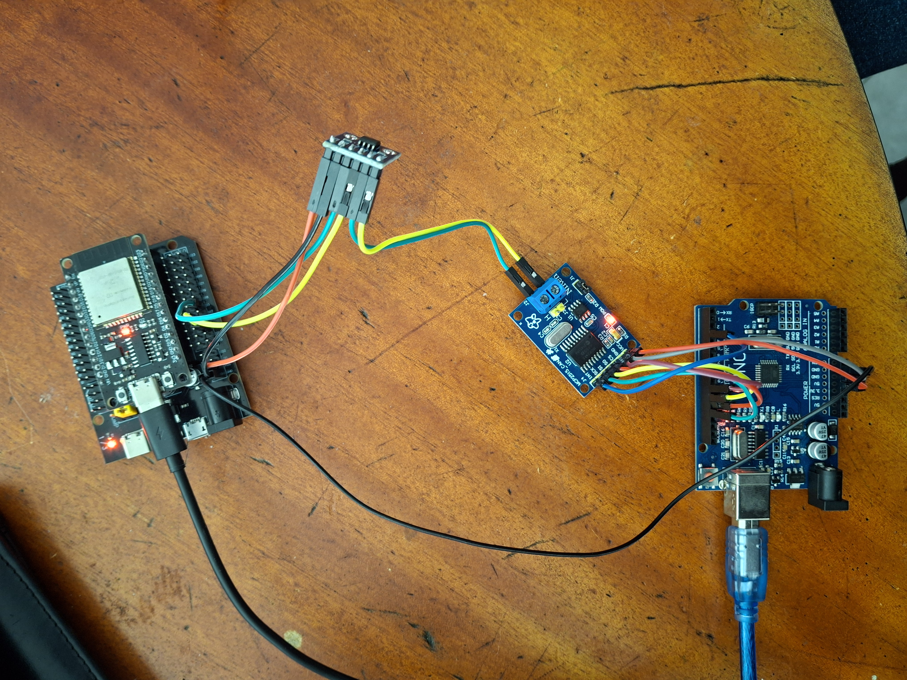

# Conexión CAN básica con Arduino y ESP32

En esta carpeta se describe un prototipo realizado con el objetivo de probar la comunicación CAN del ESP32. La idea es enviar mensajes desde el Arduino y recibirlos en la ESP32.

## Diseño

Se conecta un Arduino uno a un módulo MCP2515. El módulo MCP2515 se comunica a través de CAN a un transciever Sn65hvd230, el cual se conecta a una ESP32.

El Arduino no tiene un controlador CAN incluido, por lo que se debe conectar al módulo MCP, este módulo se comunica por SPI al arduino, y tiene incluido un transceiber TJA1050. La ESP32 incluye un control CAN, por lo que solo necesita un transceiver. En este caso, usé el Sn65hvd230 porque está diseñado para trabajar con dispositivos de 3 V, como lo es la ESP32.

## Conexiones

### Arduino a MCP2515_CAN

| **Arduino** | **MCP2515_CAN** |
|-------------|-----------------|
| GND         | GND             |
| 5V          | VCC             |
| 2           | INT             |
| 10          | CS              |
| 11          | SI              |
| 12          | SO              |
| 13          | SCK             |

### MCP2515 a Sn65hvd230

| **MCP2515_CAN** | **Sn65hvd230** |
|-----------------|----------------|
| CANH            | CANH           |
| CANL            | CANL           |

### Sn65hvd230 a ESP32

| **Sn65hvd230** | **ESP32** |
|----------------|-----------|
| 3V3            | 3V3       |
| GND            | GND       |
| CTX            | 5         |
| CRX            | 4         |

### ESP32 a Arduino

| **Arduino** | **ESP32** |
|-------------|-----------------|
| GND         | GND             |

## Código

### Arduino

El código usado en el Arduino el el que se da de ejemplo en la librería [arduino-CAN](https://github.com/sandeepmistry/arduino-CAN).

### ESP32

